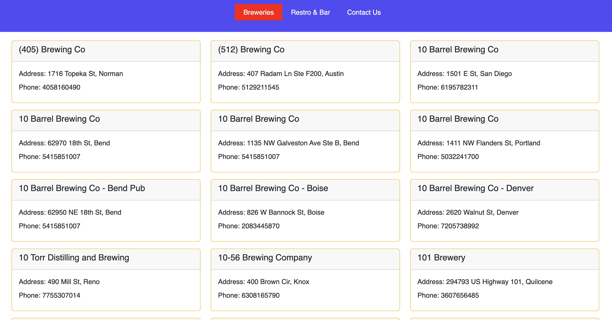
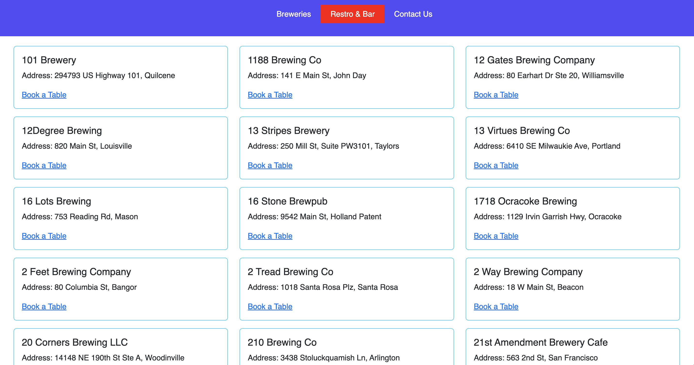
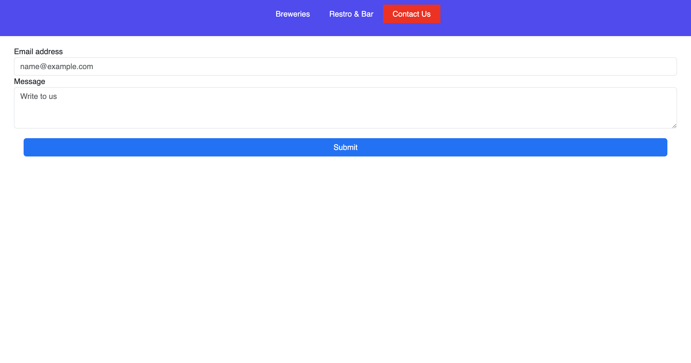

# React Redux Api Example

Lets work with asynchronous HTTP requests in the React js application using the Redux store and the Redux toolkit libraries. We will specifically learn the recommended way of using builder callback notation in extraReducers for handling HTTP requests with pending, fulfilled, and rejected states.

# Redux Store
Redux store gives utmost flexibility to React components. React components read data from a centralized Redux store.

# React Hooks
## useEffect 
is a React Hook that lets you synchronize a component with an external system.

## useDispatch 
is yet another hook in redux which is equivalent to the mapDispatchToProps argument in the connect() higher-order function. It allows you to send or dispatch an action to the redux store by giving the action as an argument to the dispatch variable.

## createSlice 
is a function available via the redux toolkit library. It accepts an initial state, an object of reducer functions, and a “slice name”, and by default, creates action creators and action types that coordinate with the reducers and state.

## createAsyncThunk 
is used to handle asynchronous requests. It produces a definitive Redux thunk action creator. The thunk action creator returns action creators that offer pending, fulfilled, and rejected cases hooked as nested fields.

In the project directory, you can run:

### `npm start`

Runs the app in the development mode.\
Open [http://localhost:3000](http://localhost:3000) to view it in your browser.

# Application Screenshots

